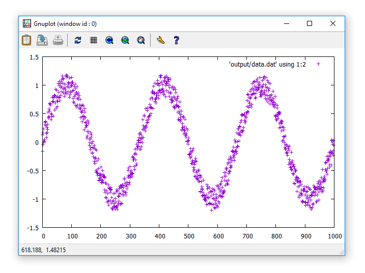
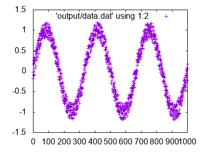
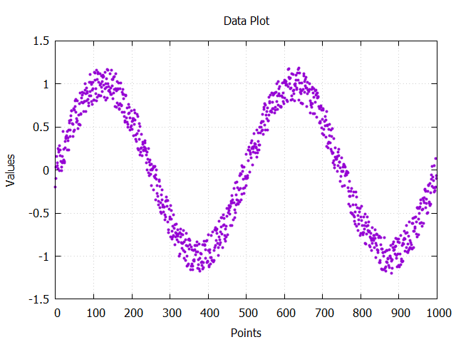

# Graphing Data with C++ and GnuPlot

**The _Hello gnuplot World_ project demonstrates a few simple ways data can be graphed with gnuplot from C++ using only the standard library.** The basic concept is that data is saved as a text file, then a system command is called to have gnuplot plot the data in that file. The graph can be saved as an image file, or gnuplot could be launched in persistent mode so the data is displayed interactively.

Styling can be achieved by launching gnuplot with a lot of arguments, or by pointing gnuplot to a .gp (gnuplot script) file containing styling information. The advantage of the .gp file is that styling isn't compiled-in, so it can be easily changed.

### Generating Sample Data
```cpp
vector<double> data;
data = NoisySin(1000, 3);
GpSaveData(data, "output/data.dat");
```

### Run gnuplot Interactively
```cpp
GpPlotDataFileInteractive("output/data.dat");
```



### Save Plot as an Image
```cpp
GpPlotDataFilePNG("output/data.dat", "output/data2.png");
```



### Create Graphs with Advanced Styling

My preferred way to create gnuplot graphs from C++ is to define all graph creation styling and data source information in a .gp script file, then simply call it with the console command `gnuplot script.gp`. An advantage of this method is that no data or styling information is compiled-in, so it can be changed easily by the end user.

```cpp
GpRunScript("dataPlot.gp");
```



Styling and data source defined in [dataPlot.gp](run/dataPlot.gp):

```python
# Indicate how to render the plot and where to save it
set terminal png size 400,300
set terminal pngcairo nocrop enhanced
set output "output/data.png"

# Labels
set title "Data Plot"
set xlabel "Points"
set ylabel "Values"

# Grid
set style line 12 lc rgb'#808080' lt 0 lw 1
set grid back ls 12

# Legend
unset key

# Plot the data
plot "output/data.dat" with points pointtype 7 pointsize .5

# Axes limits
set autoscale y
```