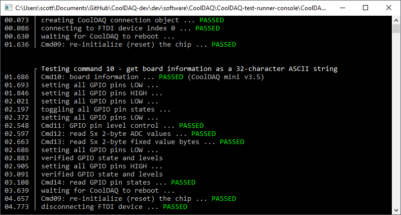

# Console Application Fonts and Extended ASCII

By default it is difficult to render non-standard (extended ASCII and/or unicode) characters. If the console itself doesn't support the encoding, the default font often doesn't support the characters. Registry hacks can change the default console font system-wide, but it requires a restart and doesn't work with Visual Studio's console (launched with F5).

The best way I found to render things like ASCII line art is to create a class to interact with kernel32.dll. This requires enabling unsafe code though (project -> project properties -> build -> allow unsafe code). 

Monospace fonts which support ASCII line art are `Consolas` and `Courier New`.

## Screenshot
This screenshot shows ASCII line art drawn by a C# console application.



## Available Characters
The following are unicode character values which render well with Consolas font.

code | code | code | code | code | code | code | code | code | code
-------|--------|--------|--------|--------|--------|--------|--------|--------|--------
9472 ─ | 9474 │ | 9484 ┌ | 9488 ┐ | 9492 └ | 9496 ┘ | 9500 ├ | 9508 ┤ | 9516 ┬ | 9524 ┴ | 
9532 ┼ | 9552 ═ | 9553 ║ | 9554 ╒ | 9555 ╓ | 9556 ╔ | 9557 ╕ | 9558 ╖ | 9559 ╗ | 9560 ╘ | 
9561 ╙ | 9562 ╚ | 9563 ╛ | 9564 ╜ | 9565 ╝ | 9566 ╞ | 9567 ╟ | 9568 ╠ | 9569 ╡ | 9570 ╢ | 
9571 ╣ | 9572 ╤ | 9573 ╥ | 9574 ╦ | 9575 ╧ | 9576 ╨ | 9577 ╩ | 9578 ╪ | 9579 ╫ | 9580 ╬ | 
9600 ▀ | 9604 ▄ | 9608 █ | 9612 ▌ | 9616 ▐ | 9617 ░ | 9618 ▒ | 9619 ▓ | 9632 ■ | 10003 √ | 

```cs
var styler = new ConsoleStyler();
styler.SetConsoleFont("Consolas");

int[] interestingUnicodeChars = { 9472, 9474, 9484, 9488, 9492, 9496, 9500, 9508, 9516,
    9524, 9532, 9552, 9553, 9554, 9555, 9556, 9557, 9558, 9559, 9560, 9561, 9562, 9563,
    9564, 9565, 9566, 9567, 9568, 9569, 9570, 9571, 9572, 9573, 9574, 9575, 9576, 9577,
    9578, 9579, 9580, 9600, 9604, 9608, 9612, 9616, 9617, 9618, 9619, 9632, 9644, 9650,
    9658, 9660, 9668, 9786, 9787, 9788, 9824, 9827, 9829, 9830, 9835, 10003, 10072 };

foreach (int i in interestingUnicodeChars)
{
    byte[] unicodeBytes = BitConverter.GetBytes(i);
    string unicodeString = Encoding.Unicode.GetString(unicodeBytes);
    Console.WriteLine($"{i} {unicodeString}");
}
```

## ConsoleStyler.cs
```cs
public class ConsoleStyler
{
    public ConsoleStyler()
    {
    }
    
    public void SetConsoleFont(string fontName = "Consolas")
    {
        unsafe
        {
            IntPtr hnd = GetStdHandle(STD_OUTPUT_HANDLE);
            if (hnd != INVALID_HANDLE_VALUE)
            {
                CONSOLE_FONT_INFO_EX info = new CONSOLE_FONT_INFO_EX();
                info.cbSize = (uint)Marshal.SizeOf(info);

                // Set console font
                CONSOLE_FONT_INFO_EX newInfo = new CONSOLE_FONT_INFO_EX();
                newInfo.cbSize = (uint)Marshal.SizeOf(newInfo);
                newInfo.FontFamily = TMPF_TRUETYPE;
                IntPtr ptr = new IntPtr(newInfo.FaceName);
                Marshal.Copy(fontName.ToCharArray(), 0, ptr, fontName.Length);

                // Get some settings from current font
                double sizeY = 16;
                double sizeX = sizeY;
                newInfo.dwFontSize = new COORD((short)(sizeX), (short)(sizeY));
                newInfo.FontWeight = info.FontWeight;
                SetCurrentConsoleFontEx(hnd, false, ref newInfo);
            }
        }
    }

    [StructLayout(LayoutKind.Sequential, CharSet = CharSet.Unicode)]
    internal unsafe struct CONSOLE_FONT_INFO_EX
    {
        internal uint cbSize;
        internal uint nFont;
        internal COORD dwFontSize;
        internal int FontFamily;
        internal int FontWeight;
        internal fixed char FaceName[LF_FACESIZE];
    }

    [StructLayout(LayoutKind.Sequential)]
    internal struct COORD
    {
        internal short X;
        internal short Y;

        internal COORD(short x, short y)
        {
            X = x;
            Y = y;
        }
    }

    private const int STD_OUTPUT_HANDLE = -11;
    private const int TMPF_TRUETYPE = 4;
    private const int LF_FACESIZE = 32;
    private static IntPtr INVALID_HANDLE_VALUE = new IntPtr(-1);

    [DllImport("kernel32.dll", SetLastError = true)]
    static extern bool SetCurrentConsoleFontEx(
        IntPtr consoleOutput,
        bool maximumWindow,
        ref CONSOLE_FONT_INFO_EX consoleCurrentFontEx);

    [DllImport("kernel32.dll", SetLastError = true)]
    static extern IntPtr GetStdHandle(int dwType);

    [DllImport("kernel32.dll", SetLastError = true)]
    static extern int SetConsoleFont(
        IntPtr hOut,
        uint dwFontNum
        );
}
```

### Usage
```cs
var styler = new ConsoleStyler();
styler.SetConsoleFont("Consolas");
```
