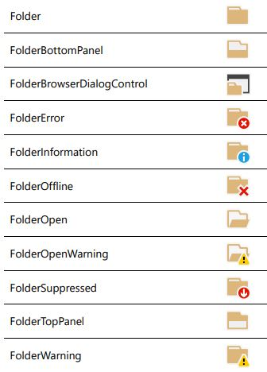

# Icons

## Icon Packs
* [Material Icons](https://material.io/tools/icons/)
* [Open Iconic](https://useiconic.com/open)
* [Modern UI Icons](http://modernuiicons.com/)
* [Icons8 Flat Color Icons](https://github.com/icons8/flat-color-icons)
* [Icons8 Windows 10 Icons](https://github.com/icons8/windows-10-icons)

## System Icons
There are very few and they're kind of awful. [link](http://csharphelper.com/blog/2015/09/display-the-predefined-system-icons-in-c/)

```cs
ImageList images = new ImageList();
images.Images.Add(new Icon(System.Drawing.SystemIcons.Application, new Size(16, 16)));
images.Images.Add(new Icon(System.Drawing.SystemIcons.Information, new Size(16, 16)));
treeViewDir.ImageList = images;
```

## Visual Studio Image Library
The Visual Studio Image Library contains application images that appear in Microsoft Visual Studio, Microsoft Windows, the Office system and other Microsoft software. The libraries for Visual Studio 2012, Visual Studio 2013, Visual Studio 2015, and Visual Studio 2017 are available and each library contains over thousands of images which can be used to create applications that look visually consistent with Microsoft software. 

All icons (PDF) | Download | Screenshot
---|---|---
[VS2017.pdf](https://github.com/swharden/code-notes/raw/master/Csharp/misc/Visual%20Studio%20Image%20Library%202017.pdf) | [VS2017.zip](https://www.microsoft.com/en-us/download/details.aspx?id=35825) | 
